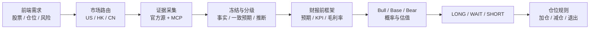

# SignalForge

SignalForge 是一个可运行的一键财报前研究系统：前端收集股票、市场、当前仓位、成本和风险偏好；后端用 Public Equity Investing 的财报前框架组织 `global-stock-data`、`a-stock-data` 与 `vibe_trading_dev0` 的证据，并输出 LONG / WAIT / SHORT、情景估值和条件化仓位动作。

系统只做研究与风险决策，不连接券商，不自动下单。

## 能力边界

- `NVDA + DEMO`：展示完整研究报告样例，所有数值明确标记为非实时。
- 美股通用代码：现场读取 Nasdaq 行情/EPS 与 SEC/IR 公司事实；部分源可用时保留真实数据并限制为 `WAIT`。
- A 股六位代码：现场读取腾讯行情/K 线、新浪利润表、同花顺机构 EPS 汇总、交易所公告与预约披露日；不需要为每只股票预先准备模板。
- `OFFICIAL`：冻结 SEC 公司业绩/指引、Nasdaq 行情/EPS/事件期权摘要与 FINRA 短成交量；无需访问本机隧道。
- `LOCAL_RESEARCH`：通过本机 SSH 隧道调用 dev0 的只读 HTTP MCP，并与 Nasdaq EPS 一致预期形成可验证的实时实施链路。
- 页面首屏健康检查通过后会自动运行一次 NVDA 公开证据分析，并显示后端逐阶段进度。
- 收入卖方一致预期和借券费率需要授权数据源；未配置时明确标记为受限，不用公司指引或 FINRA 短成交量冒充。
- 页面会显示请求校验、市场路由、数据源、证据门槛、情景与报告生成的真实后端进度；演示模式会明确显示“未请求实时数据”。
- 做空必须补齐借券成本、利用率、拥挤度和挤压风险，缺一则不能标记为 `implementation-ready`。

## 本地启动

要求 Node.js `24.x`。

```bash
cp .env.example .env.local
npm install
npm run dev
```

访问 `http://localhost:3000`。接口：

- `POST /api/analyze`：生成结构化报告。
- `POST /api/analyze/stream`：以 NDJSON 推送分析阶段与最终报告。
- `GET /api/health`：检查服务与 `vibe_trading_dev0` 连接状态。

## Vercel 部署

项目使用标准 Next.js 构建，可直接部署到 Vercel：

```bash
npx vercel@latest deploy --prod
```

当前生产地址：
[`https://signalforge-equity-cockpit-dusky.vercel.app`](https://signalforge-equity-cockpit-dusky.vercel.app)。
项目级 SSO 部署保护应保持关闭，确保页面可公开访问。

源代码：
[`zhiyao88kuai-lab/An-Tranding`](https://github.com/zhiyao88kuai-lab/An-Tranding)。
每次推送到 `main` 都会运行构建、API 测试和生产依赖审计；手动运行
`SignalForge CI` 时可传入生产地址执行站外冒烟测试。

部分中国大陆网络会直接重置 `*.vercel.app` 连接。若出现
`ERR_CONNECTION_RESET`，应给项目绑定自有域名；这属于域名/网络可达性问题，
不是 Next.js 应用或 API 故障。

公网环境默认使用 `OFFICIAL`。Vercel 无法访问本机 `127.0.0.1` 上的 SSH
隧道，但公开分析链不再依赖该隧道：SEC 公司事实、Nasdaq 行情/EPS/
事件期权摘要与 FINRA 派生比率可直接由服务端获取。dev0 MCP 作为本地增强
链；若未来需要让 Vercel 使用它，仍应通过 Cloudflare Tunnel + Access
服务令牌连接，禁止公开暴露 MCP。

可在 Vercel 中设置以下服务端环境变量：

- `DATA_MODE=OFFICIAL`：公开证据链默认值。
- `SEC_USER_AGENT`：仅在启用官方 SEC 连接探测时设置真实联系信息。
- `CONSENSUS_PROVIDER_URL`：可选；默认使用 Nasdaq analyst forecast API，
  当前接入 EPS 一致预期，不包含收入一致预期。
- `NVDA_NEXT_EARNINGS_DATE`：NVIDIA 下一次官方财报日期；事件期权适配器会在
  日期过期后自动失效，避免错误地把普通到期波动标成财报隐含波动。
- `NVDA_NEXT_EARNINGS_CALL_UTC`：官方电话会 UTC 时间；系统据此同时显示
  太平洋时间和北京时间，并计算财报前后催化剂的明确日期区间。

不要将 `VIBE_MCP_AUTH_TOKEN`、SSH 私钥或任何本机凭据写入源码或
`NEXT_PUBLIC_*` 环境变量。

## 最安全的 dev0 连接

远端 HTTP MCP 应只监听 dev0 的 `127.0.0.1`，本机通过 SSH 本地端口转发访问：

```bash
VIBE_SSH_TARGET=dev0 ./scripts/start-vibe-tunnel.sh
```

等价命令：

```bash
ssh -N -T \
  -L 127.0.0.1:18900:127.0.0.1:8900 \
  -o ExitOnForwardFailure=yes \
  -o ServerAliveInterval=30 \
  -o ServerAliveCountMax=3 \
  -o TCPKeepAlive=no \
  dev0
```

然后在 `.env.local` 中设置：

```dotenv
VIBE_MCP_URL=http://127.0.0.1:18900/mcp
```

安全设计：

- 隧道只绑定本机回环地址，不开放 LAN 或公网端口。
- MCP URL 和令牌只在服务端读取，绝不进入浏览器 bundle。
- 后端只允许调用研究所需的只读工具白名单。
- SSH 密钥交给系统 keychain / agent 管理，不写入项目。
- 公网部署不能访问用户本机的 `127.0.0.1`；完整私有数据模式应在本机运行，或使用带身份认证和网络访问控制的私有网关。

## 研究工作流



### 数据路由

| 市场 | 官方优先 | 本地个人研究补充 | 用途 |
|---|---|---|---|
| 美股 | SEC EDGAR | CBOE、FINRA、行情源、vibe MCP | Filing、财务、期权、空头、行情 |
| 港股 | 港交所公告 | 行情源、vibe MCP | 公告、财务、行情 |
| A 股 | 巨潮资讯 | 腾讯、同花顺、东财、mootdx | 公告、一致预期、资金、行情 |

其中 CBOE、FINRA 以及多数门户/行情站点存在许可或再分发限制。公网模式默认只使用可确认授权的数据；个人研究适配器只在本地模式启用。

A 股当前采用按需采集：每次提交股票代码都会重新冻结行情、财务、机构预期和事件日期。数据库或缓存只应作为后续的性能与历史审计增强，不能成为新股票能否分析的前置条件。

## 报告结构

1. 证据冻结时间、数据状态和 GAAP / 非 GAAP 口径。
2. 一致预期表：t / t-1 / t-4 / t-8。
3. 3–6 个股价敏感 KPI 与各自财报门槛。
4. 毛利率 Bull / Bear 桥接与必须追问项。
5. Bull / Base / Bear 三情景，概率合计 100%。
6. 催化剂路径、管理层问题、证伪条件。
7. 结合用户当前仓位和风险偏好的条件化动作。
8. 数据源账本、证据缺口与 actionability 等级。

## 尚需授权的数据

- 补充有授权的收入一致预期源，并持久化每次冻结快照。
- 补充具备再分发权限的借券费率、利用率和可借量；在此之前做空只能是研究情景。
- 为公司 KPI 建立可配置 schema，而不是用通用指标硬套。
- 加入用户认证、任务队列、报告历史和审计日志。
- 如需对外商业使用，先完成所有行情、期权、研报与门户数据的许可证核查。
